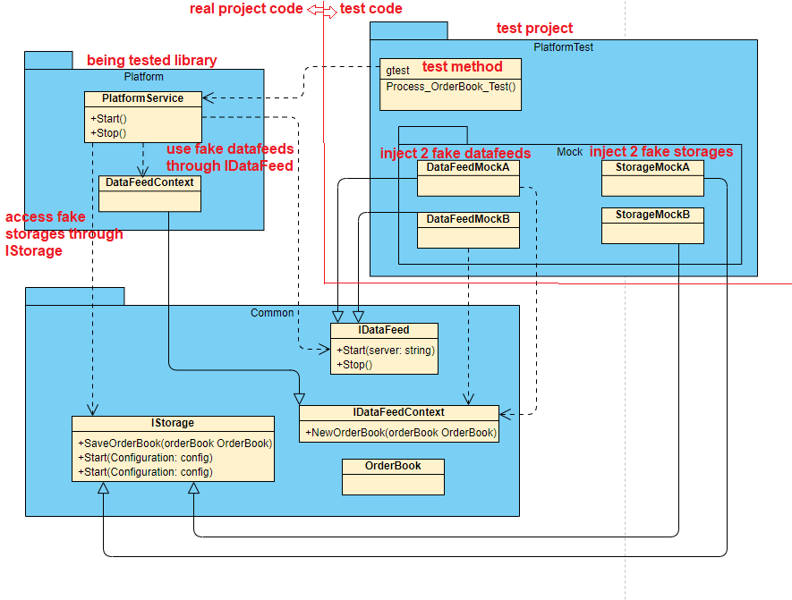

# OrderBookDataCollector
## A Complete Guide For Object Oriented Programming Using C++ 17 & VS Code CMake on Linux.
Continue updating ...

## Requirement
* Connect to Binance (or multiple other APIs) Websocket api(document: https://github.com/binance/binance-spot-api-docs/blob/master/web-socket-streams.md#how-to-manage-a-local-order-book-correctly)
* Receive order book data with real-time connection (Websocket);
* Save data to Redis & MongoDB (and other databases) asynchronously;
* All modules are testable, unit test code coverage could be over 95%;
* System extensibility: more data feeds and other storages can be added without the change to the whole system;

## OOP Explanation

### Coding convention

Java & C# are relatively new languages compared to C++ or C, and they are more 'OOP friendly'.

Here, I borrowed some good coding practice from Java/C#:

* Name variables clearly, use full words instead of abbreviations.

* Use Pascal naming convention for type definition names(class, struct, enum etc), method names, public variables; Use camel naming convention for private variables, parameters, local variables etc.

* Use nested namespaces, and make sure the namespaces are according to folder names.

* All classes, structs, enum (practically all function code) ..., must be written inside namespaces.

### Interfaces in C++

Unlike C#, there is no interface in C++, in order to achieve such abstraction I use pure virtual classes to declare interface like method signatures.

### SOLID Principles
Single Responsibility: 

Keep in mind the SOLID principles. Make sure every class does only highly related things, and one method does one thing only. If a method is over 50 lines, it may be too chubby, try make it slimmer by splitting into methods. If a class is bigger than 500 lines, we may need to review to class and consider dividing it into smaller ones. Make sure it is high cohesion within one class, and low coupling between any two classes(see Inversion of Control).

Open Close:

Adding new datafeeds or storages won't require compilation of the other components, which means it's open for extension. Moreover, no modification is neccesary to the existing code, hence close modification.

Dependency Inversion: 

As we can see both MongoDB and Redis modules implement the same interface, the caller (PlatformService here) doesn't need to know about the concrete implementation, only call the method through interfaces. This is call 'Inversion of Control', i.e. components depend on interfaces instead of concrete classes.

### Dependency Injection (DI)

Inject IDataFeedContext object to DataFeed implementation to allow call back notifications.

Inject IStorage objects & IDataFeed objects using service locator.

Inject serviceLocators into PlatformService, so it only depends on interfaces instead of concrete implementations.

Test PlatformService with Mock dependencies (2 fake DataFeeds and 2 fake Storages).

## Class diagram

As we can see the main library PlatformService, which starts all functions, has no dependent to any concrete storages or datafeeds. 

It only depends on interfaces (pure virtual classes) IStorage and IDataFeed, actually it doesn't even know the existence of RedisStorage, MongoDBStorage and BinanceDataFeed, which makes it totally testable. 

We can create a mock storage and a mock datafeed to test PlatformService.

Also Storages and DataFeeds can hide their complex code in the library, only expose the interfaces that they implement. Testing these library is easy because we don't need to pay attention to their implementation details, but only focus on the input and output of the interfaces, which the unit test code should test against.


## Testability Explanation

Testability is achieved by reducing the coupling among modules. 

The concept Inversion of Control (IoC) from SOLID is the best tool to reduce coupling.

When the dependencies are interfaces, we can easily inject mock implementations to test the modules (Example here is PlatformService library ...).

### TDD

Writing test code before any implementation is possible once the interfaces are defined.

In this project, when we finish writing the interfaces in Common, we can start writing unit test code for some modules even before they are being implemented.

Check out the below unit test diagram for testing PlatformService. It is very similar with the project class diagram, except that the Binance DataFeed has been replaced with two(can add as many as you want) fake DataFeeds, and the MongoDBStorage & RedisStorage have been taken over by two (also can add as many as you want) fake Storages.

Now we can create whatever fake data with fake DataFeeds, and stream it into PlatformService to test whether the Storages can finally receive the correct data. This whole process does NOT involve any connection to third party APIs for incoming data or physical databases for storing data. 

What a blast!



Writing test code for Storages or DataFeeds is way more easier than PlatformServices, because they have fewer dependencies. I will let the code speaks, instead of explaining here.

### GoogleTest

A great unit test framework used in this projects, really worth digging.

https://github.com/google/googletest

## Finally, run the project


# More information to run this project

## Install Storage Support

### Install Docker

https://docs.docker.com/engine/install/ubuntu/

### Install Redis

`$sudo docker run -d -p 63790:6379 --name enjoy-redis redis:latest`


Install redis-cli(Optional): 

https://codewithhugo.com/install-just-redis-cli-on-ubuntu-debian-jessie/


### Install MongoDB

`$sudo docker run -d -p 27170-27172:27017-27019 --name mongodb mongo:latest`

## Compile Project

VS Code: https://code.visualstudio.com/docs/cpp/CMake-linux

Install OpenSSL: 
`$sudo apt-get install libssl-dev`


Install boost: 
`$sudo apt-get install libboost-all-dev`


Clone nlohmann json, put nlohmann/single_include/nlohmann into ThirdParties:

`$git clone https://github.com/nlohmann/json`

`$cp -a json/single_include/nlohmann ~/Code/OrderBookDataCollector/ThirdParties`


Download asio-1.18.1, put asio-1.18.1/include into ThirdParties and change name to asio-1.18.1:

`$wget https://udomain.dl.sourceforge.net/project/asio/asio/1.18.1%20%28Stable%29/asio-1.18.1.tar.gz`

`tar -xf asio-1.18.1.tar.gz`

`cp -a asio-1.18.1/include ~/Code/OrderBookDataCollector/ThirdParties`

`sudo mv ~/Code/OrderBookDataCollector/ThirdParties/include ~/Code/OrderBookDataCollector/ThirdParties/asio-1.18.1`

Clone websocketpp, put websocketpp/websocketpp into ThirdParties:

`$git clone https://github.com/zaphoyd/websocketpp`

`$cp -a websocketpp/websocketpp ~/Code/OrderBookDataCollector/ThirdParties`


Install Redis plus plus support:

`$sudo apt install cmake`

`$sudo apt-get install -y build-essential`

https://github.com/sewenew/redis-plus-plus#installation

`$git clone https://github.com/redis/hiredis.git`

`$cd hiredis && make && sudo make install && cd ..`


`$git clone https://github.com/sewenew/redis-plus-plus.git`

`$cd redis-plus-plus && mkdir build && cd build && cmake .. && make && sudo make install cd ../..`

Install MongoDB driver: 

Installing the current release of the MongoDB C Driver (libmongoc) and BSON library (libbson): 

http://mongoc.org/libmongoc/1.17.5/installing.html

```
$ sudo apt-get install libmongoc-1.0-0

$ sudo apt-get install libbson-1.0-0

$ sudo apt-get install cmake libssl-dev libsasl2-dev

$ wget https://github.com/mongodb/mongo-c-driver/releases/download/1.17.5/mongo-c-driver-1.17.5.tar.gz
$ tar xzf mongo-c-driver-1.17.5.tar.gz
$ cd mongo-c-driver-1.17.5
$ mkdir cmake-build
$ cd cmake-build
$ cmake -DENABLE_AUTOMATIC_INIT_AND_CLEANUP=OFF ..

$ cmake --build .
$ sudo cmake --build . --target install

```

Install mongocxx-driver: 

http://mongocxx.org/mongocxx-v3/installation/linux/#step-3-download-the-latest-version-of-the-mongocxx-driver

```
$ curl -OL https://github.com/mongodb/mongo-cxx-driver/releases/download/r3.6.5/mongo-cxx-driver-r3.6.5.tar.gz
$ tar -xzf mongo-cxx-driver-r3.6.5.tar.gz
$ cd mongo-cxx-driver-r3.6.5/build

$ cmake ..                                \
    -DCMAKE_BUILD_TYPE=Release          \
    -DCMAKE_INSTALL_PREFIX=/usr/local

$ sudo cmake --build .
$ sudo cmake --build . --target install

```

Include CPPServiceLocator:

`$git clone https://github.com/stevef51/CPPServiceLocator.git`

`$mv CPPServiceLocator ~/Code/OrderBookDataCollector/ThirdParties/`

VS Code Command Palette: 

`$CMake: Build`

`$CMake: Debug`


## Possible Improvements

* Use CRTP to boost the performance for virtual/override;
* Use extern "C" to load datafeeds & storage from a configuration file, therefore they can be treated like 'plugins', and can totally remove dependencies of them from main() project;
